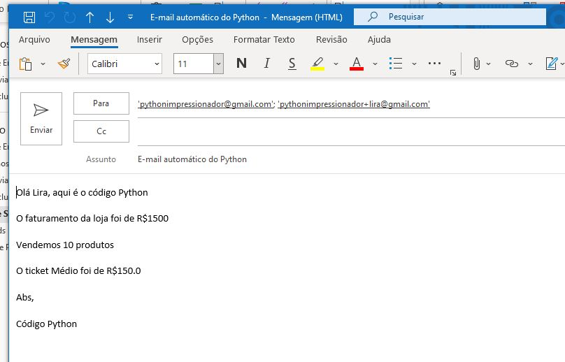

<h2 align="center">Enviar via Python no windows?</h2>

___

<p align="center">
  
</p>

<p align="center">
  <a href="LICENSE">
    
  </a>
</p>

___

<h3 align="center">
  <a href="#information_source-sobre">Sobre</a>&nbsp;|&nbsp;
  <a href="#interrobang-motivo">Motivo</a>&nbsp;|&nbsp;
  <a href="#seedling-requisitos-mínimos">Requisitos</a>&nbsp;|&nbsp;
  <a href="#rocket-tecnologias-utilizadas">Tecnologias</a>&nbsp;|&nbsp;
  <a href="#licença">Licença</a>
</h3>

___


## :information_source: Sobre

Exemplo usado para envio de e-mail simples direto pelo outlook.

## :interrobang: Motivo

Programa para facilitar o envio de e-mail.

## :seedling: Requisitos Mínimos

- Python 3
- Prompt de comando / PowerShell
- Instalar as dependencias antes de executar
  - Passos:

  ```
   # pip install -r requirements.txt
   
   # python enviarmail.py

  ```

## :rocket: Tecnologias Utilizadas

O projeto foi desenvolvido utilizando as seguintes tecnologias

- Python

## Licença

Esse projeto está sob a licença MIT. Veja o arquivo [LICENSE](LICENSE) para mais detalhes.
